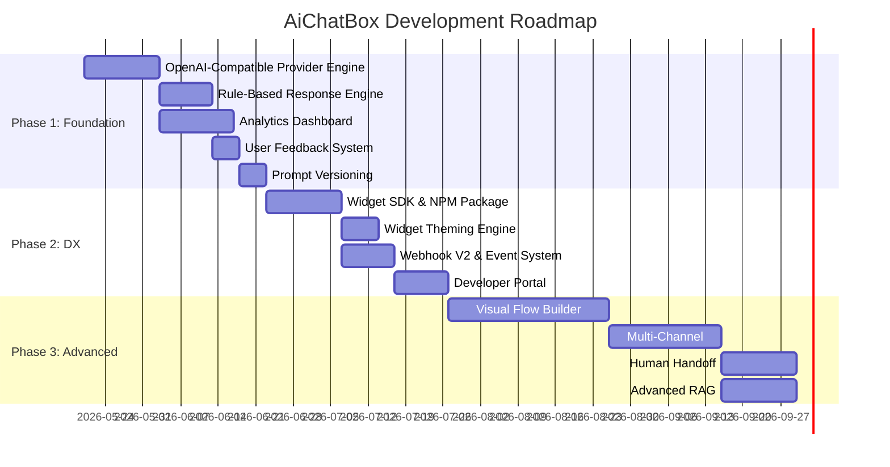

# AiChatBox — Revised Strategic Roadmap

## Decisions Made

| Question | Answer |
|---|---|
| **Target audience** | Developers embedding AI chat into their products |
| **Local models (Ollama)?** | Not now — no powerful machine/server. Use hosted providers instead. |
| **Monetization** | None planned |

These decisions sharpen the roadmap significantly. As a **developer tool**, the priority is: rock-solid APIs, more provider options, developer-friendly configuration, and features that make the embedded widget genuinely useful to end users.

---

## Current State Summary

AiChatBox is a 3-tier system (ASP.NET API + Vue Dashboard + JS Widget) that proxies LLM calls through a multi-tenant project/configuration layer. It already has:

✅ Multi-project tenancy with API keys  
✅ Streaming chat (SSE) with agent tool-calling  
✅ RAG via pgvector (document upload + website crawl)  
✅ Custom webhook tools with JSON schema validation  
✅ Live voice via Gemini Live + SignalR  
✅ Database SQL agent (auto schema detection)  
✅ Rate limiting, budgets, logging  
✅ Embeddable widget with domain allowlisting  

The core gap: **all intelligence is borrowed** — the platform adds orchestration plumbing but no proprietary logic layer.

---

## Hosted AI Providers to Add

> [!NOTE]
> Since self-hosted models aren't viable right now, the best strategy is to dramatically expand hosted provider support. Many of these offer **free tiers** or very cheap inference, reducing single-provider dependency.

Your `ILlmProviderService` interface is already well-designed for this. Each provider just needs a new implementation.

| Provider | Why | Free Tier? | API Style |
|---|---|---|---|
| **OpenAI** | Industry standard, GPT-4o/o3 | ❌ Pay-as-you-go | OpenAI |
| **Anthropic Claude** | Best for long-context, safety | ❌ Pay-as-you-go | Custom (similar) |
| **Together AI** | 100+ open models (Llama, Mistral, Qwen) hosted | ✅ $5 free credit | OpenAI-compatible |
| **Fireworks AI** | Fast inference, open models | ✅ $1 free credit | OpenAI-compatible |
| **Mistral AI** | Mistral Large/Small/Codestral | ✅ Free tier available | OpenAI-compatible |
| **DeepInfra** | Cheapest open model hosting | ✅ Free tier | OpenAI-compatible |
| **OpenRouter** | Meta-router to 100+ models (single API key) | ✅ Free models available | OpenAI-compatible |
| **Cerebras** | Fastest inference (Llama 70B in ~1s) | ✅ Free tier | OpenAI-compatible |
| **SambaNova** | Ultra-fast Llama inference | ✅ Free tier | OpenAI-compatible |

> [!TIP]
> **Quick win**: Since Together AI, Fireworks, Mistral, DeepInfra, OpenRouter, Cerebras, and SambaNova all use the **OpenAI-compatible API format**, implementing a single `OpenAiCompatibleService : ILlmProviderService` with a configurable base URL would unlock **all of them at once**. You'd only need to store `baseUrl` + `apiKey` per provider.

### Architecture for Multi-Provider

```
Current LlmProviderFactory:
  "gemini" → GeminiServerService
  "groq"  → GrokServerService  (OpenAI-compatible)

Proposed:
  "gemini"     → GeminiServerService           (Gemini-native API)
  "openai"     → OpenAiCompatibleService(baseUrl: "https://api.openai.com/v1")
  "groq"       → OpenAiCompatibleService(baseUrl: "https://api.groq.com/openai/v1")
  "anthropic"  → AnthropicServerService         (Claude Messages API)
  "together"   → OpenAiCompatibleService(baseUrl: "https://api.together.xyz/v1")
  "fireworks"  → OpenAiCompatibleService(baseUrl: "https://api.fireworks.ai/inference/v1")
  "mistral"    → OpenAiCompatibleService(baseUrl: "https://api.mistral.ai/v1")
  "openrouter" → OpenAiCompatibleService(baseUrl: "https://openrouter.ai/api/v1")
  "deepinfra"  → OpenAiCompatibleService(baseUrl: "https://api.deepinfra.com/v1/openai")
  "cerebras"   → OpenAiCompatibleService(baseUrl: "https://api.cerebras.ai/v1")
  "sambanova"  → OpenAiCompatibleService(baseUrl: "https://api.sambanova.ai/v1")
  "custom"     → OpenAiCompatibleService(baseUrl: user-provided)
```

This means your existing `GrokServerService` can likely be refactored into the generic `OpenAiCompatibleService` — it's already using the OpenAI format.

---

## Revised Phased Roadmap

### Phase 1: Strengthen the Developer Platform
*Goal: Make AiChatBox the best choice for developers embedding AI chat.*

---

#### 1.1 — OpenAI-Compatible Provider Engine
**Effort: M (Medium) | Impact: 🔥🔥🔥🔥🔥**

Build a single `OpenAiCompatibleService` that accepts `(baseUrl, apiKey)` and instantly unlocks 10+ providers. Refactor `GrokServerService` into this.

##### Changes:
- **[NEW]** `Services/OpenAiCompatibleService.cs` — Generic OpenAI-compatible provider
- **[MODIFY]** `Models/ProjectModels.cs` — Add provider base URL + API key fields to `ProjectConfiguration`
- **[MODIFY]** `Services/LlmProviderFactory.cs` — Dynamic provider resolution with custom base URLs
- **[MODIFY]** `Controllers/ConfigurationController.cs` — UI for adding custom providers
- **[DELETE]** `Services/GrokServerService.cs` — Absorbed into OpenAiCompatibleService

##### New ProjectConfiguration fields:
```csharp
// In addition to existing GeminiApiKey, GroqApiKey, OpenAiApiKey:
public string? AnthropicApiKey { get; set; }
public string? CustomProviderName { get; set; }      // e.g. "together", "fireworks"
public string? CustomProviderBaseUrl { get; set; }    // e.g. "https://api.together.xyz/v1"
public string? CustomProviderApiKey { get; set; }
```

---

#### 1.2 — Rule-Based Response Engine (Zero-LLM Responses)
**Effort: M | Impact: 🔥🔥🔥🔥**

A lightweight pre-processor that intercepts messages before they hit any LLM:

- **Keyword rules**: `"pricing" → "Our plans start at $9/mo. Visit example.com/pricing"`
- **Regex rules**: Pattern matching for emails, order numbers, etc.
- **Q&A pairs**: Exact-match question → answer (from knowledge base or manual)
- **Fallback**: Only if no rule matches → send to LLM

##### Changes:
- **[NEW]** `Models/ConversationRule.cs` — Rule definitions (keyword, regex, Q&A)
- **[NEW]** `Services/RuleEngine.cs` — Rule matching engine
- **[NEW]** `Controllers/RuleController.cs` — CRUD API for rules
- **[MODIFY]** `Services/AiChatService.cs` — Check rules before agent execution
- **[MODIFY]** Dashboard — New "Rules" section in project detail

##### Model:
```csharp
public class ConversationRule
{
    public Guid Id { get; set; }
    public Guid ProjectId { get; set; }
    public string Type { get; set; }          // "keyword", "regex", "qa"
    public string Trigger { get; set; }        // The keyword, regex pattern, or question
    public string Response { get; set; }       // The static response to send
    public int Priority { get; set; } = 0;     // Higher = checked first
    public bool IsActive { get; set; } = true;
}
```

This directly solves the "borrowed intelligence" problem — common questions get answered instantly at zero cost.

---

#### 1.3 — Conversation Analytics Dashboard
**Effort: M | Impact: 🔥🔥🔥**

Replace the raw logs view with actionable developer metrics:

- **Volume**: Messages/day, sessions/day, active users
- **Performance**: Avg response time, token usage, cost per conversation
- **Quality**: Resolution rate, top unanswered queries, error rate
- **Model comparison**: Side-by-side performance of different models/configs
- **Knowledge gaps**: Queries where RAG returned no results

##### Changes:
- **[NEW]** `Controllers/AnalyticsController.cs` — Aggregation endpoints
- **[MODIFY]** `Views/Logs.vue` → Complete redesign as `Analytics.vue`
- **[NEW]** Dashboard components: Charts (Chart.js or built-in PrimeVue charts)

---

#### 1.4 — User Feedback System (👍/👎)
**Effort: S (Small) | Impact: 🔥🔥🔥**

Add thumbs up/down to every AI response in the widget. Store feedback, surface it in analytics.

##### Changes:
- **[MODIFY]** `Models/ChatModels.cs` — Add `Feedback` field to `ChatMessage`
- **[NEW]** `POST /api/chat/messages/{id}/feedback` endpoint
- **[MODIFY]** Widget JS — Add feedback buttons to AI messages
- **[MODIFY]** Analytics dashboard — Show feedback metrics

---

#### 1.5 — Prompt Versioning & Templates
**Effort: S | Impact: 🔥🔥🔥**

- Version history for system prompts (the `ConfigurationHistory` model already exists but isn't used!)
- Prompt template library with variables (`{{user_name}}`, `{{product}}`, `{{company}}`)
- Quick-switch between prompt versions

##### Changes:
- **[MODIFY]** `Controllers/ConfigurationController.cs` — Auto-save history on prompt update
- **[NEW]** Prompt history view in ConfigDetail.vue
- **[NEW]** Template variable substitution in `AiChatService.cs`

---

### Phase 2: Developer Experience & Ecosystem
*Goal: Make integration effortless and the widget indispensable.*

---

#### 2.1 — Widget SDK & NPM Package
**Effort: M | Impact: 🔥🔥🔥🔥**

The current widget is a single 100KB JS file. Modernize:
- Publish as an NPM package (`@aichatbox/widget`)
- TypeScript types for all configuration options
- React/Vue wrapper components
- Event hooks API (`onMessage`, `onToolCall`, `onSessionStart`)
- Programmatic API (`chatbox.sendMessage("hello")`, `chatbox.open()`)

---

#### 2.2 — Widget Theming Engine
**Effort: S | Impact: 🔥🔥🔥**

Dashboard UI for customizing widget appearance:
- Color scheme picker (primary, background, text)
- Font selection
- Logo/avatar upload
- Position (bottom-right, bottom-left, custom)
- Size presets (compact, standard, full)
- Live preview in dashboard
- CSS export

---

#### 2.3 — Webhook V2 & Event System
**Effort: M | Impact: 🔥🔥🔥🔥**

Expand webhooks beyond tool calls:
- **Events**: `session.created`, `message.received`, `message.sent`, `feedback.received`, `budget.exceeded`, `rule.matched`
- **Webhook management UI** with delivery logs and retry
- **Webhook testing** from dashboard (send sample payloads)

This is critical for developers — they need to react to chat events in their own systems.

---

#### 2.4 — API Documentation & Developer Portal
**Effort: M | Impact: 🔥🔥🔥**

The current Docs.vue is minimal. Build a proper developer portal:
- Interactive API reference (from Swagger/OpenAPI spec)
- Quickstart guides (React, Vue, vanilla JS, WordPress)
- Code snippets for every endpoint
- Widget configuration reference
- Changelog

---

### Phase 3: Advanced Features
*Goal: Differentiate from competitors.*

---

#### 3.1 — Conversation Flow Builder (Visual)
**Effort: XL | Impact: 🔥🔥🔥🔥🔥**

A drag-and-drop canvas for building conversation flows. For a developer audience, this can be positioned as a "conversation state machine" rather than a no-code tool:

- Nodes: Trigger, AI Response, Static Response, Condition, Input Capture, Webhook, Variable Set
- Flows attached to projects, can be activated/deactivated
- Flow execution engine on backend
- Falls back to standard AI chat when no flow matches

> [!NOTE]
> This is the highest-impact feature overall, but also the highest-effort. It's placed in Phase 3 because the Phase 1 features (multi-provider, rules, analytics, feedback) provide more bang-for-buck for a developer audience and can be shipped much faster.

#### 3.2 — Multi-Channel Deployment
**Effort: L | Impact: 🔥🔥🔥🔥**

WhatsApp, Slack, Telegram connectors. Build a `IChannelAdapter` interface:
```csharp
public interface IChannelAdapter
{
    Task<InboundMessage> ParseInbound(HttpRequest request);
    Task SendOutbound(OutboundMessage message);
}
```

#### 3.3 — Human Handoff
**Effort: L | Impact: 🔥🔥🔥**

Escalation to human agents when AI can't resolve. Requires:
- Live agent dashboard view
- Real-time chat takeover (SignalR)
- Configurable escalation triggers

#### 3.4 — Advanced RAG Pipeline  
**Effort: L | Impact: 🔥🔥🔥**

- Configurable chunking strategies
- Hybrid search (vector + full-text)
- Source citations in responses
- Auto-sync from Google Drive / Notion

---

## Execution Order Summary



## What to Build First

**Start with 1.1 (OpenAI-Compatible Provider Engine)**. Here's why:

1. It's the fastest way to break the Gemini dependency  
2. One generic service unlocks 10+ providers immediately  
3. Developers get model flexibility (the #1 thing they care about)  
4. Your existing `GrokServerService` already proves the pattern works  
5. Together AI, Cerebras, and SambaNova have **free tiers** — developers can start without paying  

After that, **1.2 (Rule Engine)** directly addresses the "borrowed intelligence" concern with minimal effort.

---

## Verification Plan

### For Each Feature:
- Unit tests for new services
- Integration test against at least one provider endpoint
- Manual verification via Dashboard UI
- Widget testing in a sample HTML page
- `dotnet build` passes without errors

Would you like to proceed with implementing Feature 1.1 (OpenAI-Compatible Provider Engine)?
